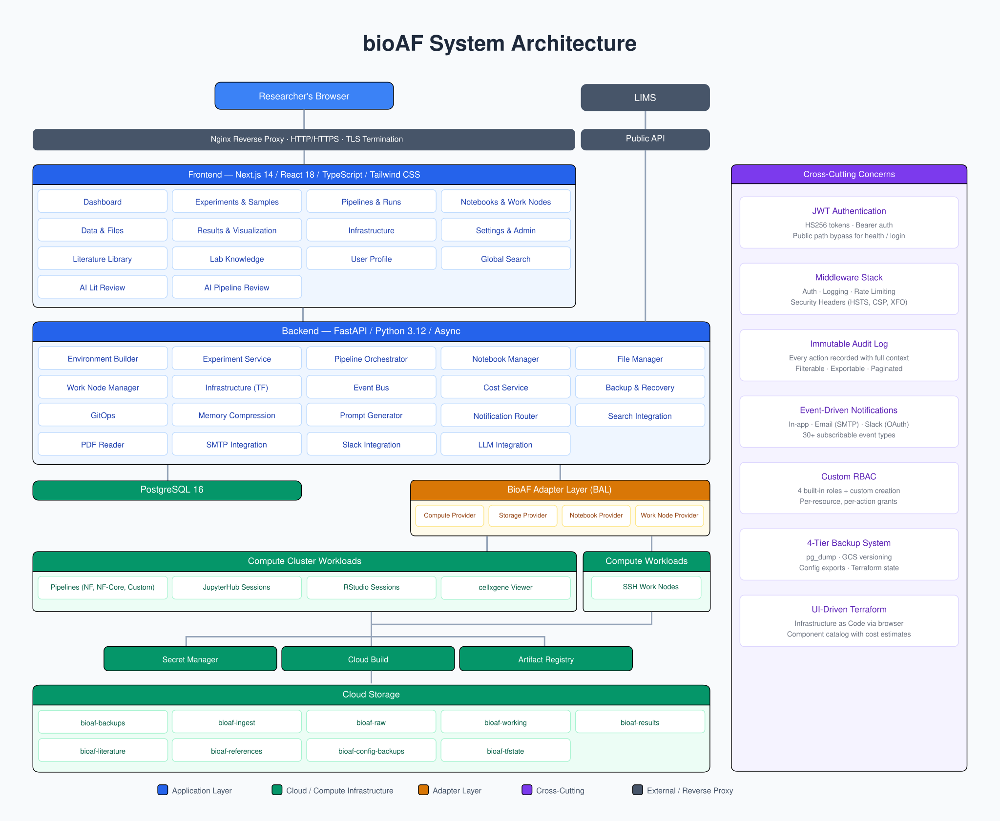

<p align="center">
  
</p>

<h1 align="center">bioAF</h1>
<p align="center"><strong>Computational Biology Automation Framework</strong></p>

A turnkey computational biology platform for small biotech companies (5-50 researchers), deployed on Google Cloud Platform. bioAF provides a web-based control plane for managing HPC clusters, notebook environments, pipeline engines, and data visualization tools -- all provisioned through UI-driven Terraform.

## Features

- **Experiment Tracking** - MINSEQE-compliant metadata, sample management, batch processing, project organization
- **Compute Orchestration** - Kubernetes (GKE) compute via the BioAF Adapter Layer, JupyterHub/RStudio notebooks, versioned compute environments, auto-scaling, Cloud Build image pipeline
- **Pipeline Engine** - Nextflow integration, custom pipelines, pipeline catalog, run monitoring, parameter management
- **Data Management** - File upload/download, dataset browser, GCS storage integration, GEO export, SuperSeries cross-experiment packaging
- **Results & Visualization** - QC dashboards, cellxgene single-cell viewer, plot archive, search
- **SSH Access** - One-click kubectl exec into running pipeline jobs and notebook sessions; standalone GCE work-node VMs ([ADR-043](decisions/ADR-043-work-nodes-gce-migration.md)) for interactive shell work outside the cluster
- **Knowledge & Records** - Literature Library (paper ingest, search, AI review), Lab Knowledge (lab documents + glossary), Scientific Decision Records (SDRs), and configurable CRO Naming Profiles
- **Notifications** - Event-driven alerts via in-app, email (SMTP), and Slack (OAuth integration)
- **Cost Center** - GCP billing integration, budget alerts, component cost breakdown, projections
- **Backup & Recovery** - 4-tier GCS backups (pg_dump, GCS versioning, platform config, terraform state), restore with review period
- **Session Credentials** - Per-user RStudio credentials with PAM authentication, auto-generated usernames
- **Role-Based Access** - Permission-based RBAC with four built-in roles, custom role creation, and per-resource/action grants
- **Upgrade System** - GitHub-based version checking, managed upgrade flow with rollback
- **Audit Log** - Immutable audit trail with filtering, pagination, and human-readable descriptions
- **GitOps** - Version-controlled platform configuration with diff and rollback
- **Integration API** - Public, key-authenticated REST surface for LIMS and other external systems, with webhooks for event delivery
- **AI Review (advisory)** - Per-org hosted LLM integration (OpenAI, Anthropic Claude, Google Gemini) that produces severity-coded advisory notes on completed pipeline runs and across-experiment comparisons. Output is advisory only, never enters provenance; every invocation is audited with provider, model, key prefix, and transmitted GCS artifact paths

## Architecture

<p align="center">
  
</p>

### How it works

A computational biologist registers an experiment, links FASTQ files (uploaded or auto-ingested from a sequencer drop), selects a pipeline from the catalog (nf-core/scrnaseq, rnaseq, or custom), and launches a run. The **BioAF Adapter Layer** handles everything below that: staging inputs from GCS, submitting Kubernetes Jobs to GKE Autopilot, monitoring execution via Nextflow trace parsing, collecting outputs back to GCS, and transitioning the experiment through its status lifecycle (`registered` -> `library_prep` -> `sequencing` -> `fastq_uploaded` -> `processing` -> `pipeline_complete` -> [`reviewed` ->] `analysis` -> `complete`). Pipeline completion triggers event-driven notifications (in-app, email, Slack), and results are browsable through the plot archive, cellxgene viewer, and GEO export tools. Jupyter and RStudio sessions run as Kubernetes Pods with GCS-backed home directories, while SSH work nodes run as standalone GCE VMs ([ADR-043](decisions/ADR-043-work-nodes-gce-migration.md)) for interactive shell work outside the cluster. RStudio sessions use per-user PAM authentication ([ADR-030](decisions/ADR-030-session-credentials-pam-auth.md)), and notebook container images are managed as versioned environments ([ADR-033](decisions/ADR-033-versioned-compute-environments.md)), built automatically via Cloud Build ([ADR-031](decisions/ADR-031-notebook-image-build-pipeline.md)).

The adapter layer ([ADR-020](decisions/ADR-020-bioaf-adapter-layer.md), recontracted in [ADR-065](decisions/ADR-065-bal-normalized-contract.md)) abstracts five runtime provider categories (compute, storage, notebook, work-node, cellxgene) plus five platform-service categories (secrets, messaging, observability, IAM, billing) behind clean interfaces. Every method returns a typed, backend-neutral normalized model, and each backend declares a `ProviderCapabilities` set that gates optional UI and is enforced server-side. The category (the "what") is separated from the backend (the "how"): a committed import guardrail (`backend/tests/test_bal_layering.py`) fails the build if any module outside `adapters/` imports a cloud or Kubernetes SDK, or if an adapter imports back up into the service layer. Today every category is implemented for GKE + GCS + the surrounding GCP platform services ([ADR-021](decisions/ADR-021-kubernetes-compute-backend.md), [ADR-022](decisions/ADR-022-gcs-storage-backend.md)); a real NFS storage backend also exists, and the remaining backend slots (SLURM, AWS, on-premise) are seams without shipped implementations.

Infrastructure is provisioned through UI-driven Terraform ([ADR-007](decisions/ADR-007-ui-driven-terraform.md)) -- researchers never touch HCL. All secrets live in Secret Manager ([ADR-008](decisions/ADR-008-secret-manager.md)), all actions are recorded in an immutable audit log ([ADR-009](decisions/ADR-009-immutable-audit-log.md)), and data portability is guaranteed ([ADR-012](decisions/ADR-012-data-portability.md)).

See all architecture decision records in [decisions/README.md](decisions/README.md).

## Quick Start

### Prerequisites

- Docker and Docker Compose
- Git
- openssl (for secret generation)

### Deploy on GCP (one command)

Run this on your local machine to provision a GCP VM and get started:

```bash
curl -fsSL https://raw.githubusercontent.com/bioAF/bioAF/main/install-gcp.sh | bash
```

The script sets up gcloud, creates a VM with Docker, and walks you through
the process. Once the VM is ready, SSH in and run:

```bash
git clone https://github.com/bioAF/bioAF.git
cd bioAF
./bioaf setup
```

### Deploy on an existing server

If you already have a Linux server with Docker installed:

```bash
git clone https://github.com/bioAF/bioAF.git
cd bioAF
./bioaf setup
```

The `setup` command handles everything: checks prerequisites, generates
secrets and TLS certs, pulls pre-built images, runs migrations, and prints
a one-time setup code. Open the URL it shows in your browser and enter the
code to create your admin account and configure the platform.

### Management Commands

| Command | Description |
| ------- | ----------- |
| `./bioaf setup` | First-run setup (pulls images, generates secrets, prints setup code) |
| `./bioaf start` | Start all services in dependency order |
| `./bioaf stop` | Stop all services |
| `./bioaf restart` | Restart all services |
| `./bioaf status` | Show service status |
| `./bioaf logs [service]` | Tail logs (all or one service) |
| `./bioaf build [service]` | Build container images locally (development only) |
| `./bioaf migrate` | Run database migrations |
| `./bioaf migrate-down <rev>` | Downgrade database to a specific revision |
| `./bioaf seed <script.py>` | Run a seed/data script in the backend container |
| `./bioaf backup` | Create a database backup |
| `./bioaf update [version]` | Update to latest (or specific) version |
| `./bioaf reset-db` | Destroy and recreate the database (with confirmation) |
| `./bioaf shell [service]` | Open a shell in a container (default: backend) |
| `./bioaf dbshell` | Open a psql session to the database |
| `./bioaf register-outputs` | Register pipeline output files from GCS |
| `./bioaf help` | Show all commands |

See the full [Deployment Guide](docs/deployment-guide.md) for detailed instructions.

## Documentation

- [Quickstart](docs/README.md) - Documentation hub
- [Deployment Guide](docs/deployment-guide.md) - Full deployment walkthrough
- [Bench Scientist Guide](docs/user-guide-bench.md) - Experiments, samples, results
- [Computational Biologist Guide](docs/user-guide-compbio.md) - Pipelines, notebooks, environments
- [Admin Guide](docs/user-guide-admin.md) - User management, costs, backups, notifications
- [Life After bioAF](docs/life-after-bioaf.md) - Data portability after teardown
- [ADR Index](decisions/README.md) - Architecture Decision Records
- [SSH Access Guide](docs/guides/ssh-access.md) - Connecting to running workloads
- [GEO Export Guide](docs/guides/geo-export.md) - Exporting to NCBI GEO
- [Reference Data Guide](docs/guides/reference-data.md) - Managing reference genomes and annotations
- [Compute Stack Setup](docs/guides/compute-stack-setup.md) - Kubernetes configuration

### Integration API

Public, key-authenticated REST surface for LIMS systems and other external
callers. The OpenAPI document at `/api/v1/integrations/openapi.json` is the
source of truth (Swagger UI at `/api/v1/integrations/docs`); the docs below
cover the contracts, conventions, and event delivery story.

- [Integration API overview](docs/api/README.md) - What this API is and is not
- [Authentication and Authorization](docs/api/auth.md) - Service accounts, API keys, scopes
- [Conventions](docs/api/conventions.md) - Error envelope, idempotency, pagination, external IDs
- Per-resource contracts: [Projects](docs/api/projects.md), [Experiments](docs/api/experiments.md), [Samples](docs/api/samples.md), [Files](docs/api/files.md)
- [Webhooks](docs/api/webhooks.md) - Event catalog, HMAC signatures, retries

## Development Setup

### Using Docker Compose (recommended)

```bash
# Start backend, frontend, and PostgreSQL
docker compose -f docker/docker-compose.dev.yml up

# Backend:  http://localhost:8000
# Frontend: http://localhost:3000
# Postgres: localhost:5432
```

### Manual Setup

```bash
# Backend
cd backend
python -m venv .venv && source .venv/bin/activate
pip install -r requirements.txt -r requirements-dev.txt
uvicorn app.main:app --reload

# Frontend
cd frontend
npm install
npm run dev

# Database (requires PostgreSQL 16)
cd backend
alembic upgrade head
```

### Running Tests

```bash
# Backend tests (requires PostgreSQL)
docker compose -f docker/docker-compose.dev.yml up -d db
cd backend && python -m pytest tests/ -v

# Frontend tests
cd frontend && npm test
```

## Component Catalog

bioAF manages these infrastructure components through its UI:

| Component | Category | Compute Stack | Dependencies |
| --------- | -------- | ------------- | ----------- |
| GKE Cluster | Compute | Kubernetes | None |
| GCS Buckets | Storage | Kubernetes | GKE |
| JupyterHub | Notebooks | Kubernetes | Compute, Storage |
| RStudio Server | Notebooks | Kubernetes | Compute, Storage |
| Nextflow | Pipelines | Kubernetes | Compute |
| cellxgene | Visualization | Any | None |
| QC Dashboard | Visualization | Any | None |

## Project Structure

```text
bioAF/
  backend/           FastAPI application
  frontend/          Next.js 14 application
  docker/            Dockerfiles, compose, and nginx config
  terraform/         GCP infrastructure as code
  helm/              Kubernetes deployment chart
  decisions/         Architecture Decision Records
  ai_guides/         Working model for humans and AI agents (process, domain language, TDD)
  docs/              User-facing documentation
  cli/               bioaf in-session CLI (provenance + heartbeat)
  sdk/               Python and R analysis SDKs
  templates/         Example pipeline/workflow templates
  installer/         Installer helper scripts and roles manifest
  changes/           Unreleased change notes
  assets/            Architecture diagram and static images
  scripts/           Utility scripts (seed data, update agent)
  tests/shell/       BATS tests for install.sh and bioaf scripts
  bioaf              Management script (entry point)
  install.sh         First-time installer (prereq checks + env generation)
  install-gcp.sh     One-command GCP provisioning script
```

## Contributing

See the ADRs in [decisions/](decisions/) for architectural context before making changes. All infrastructure changes must go through the UI-driven Terraform workflow (ADR-007). The audit log is immutable by design (ADR-009).
